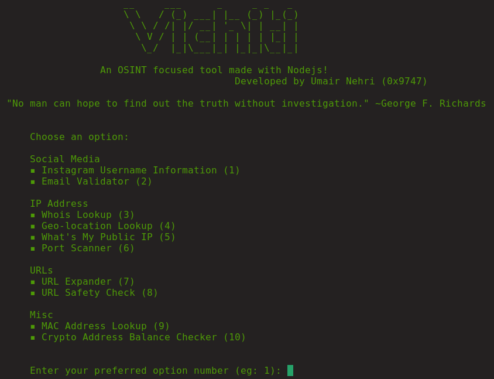

<h1 align="center">
<a href="https://github.com/umair9747/vichiti/"></a>
  <br>
  
  
  
  
  
  
  
  <br>
  
</h1>

<h2 align="left">
  <b>About Vichiti</b>
</h2>

<h1 align="center">

  </h1>

<p align="left">
  Vichiti is an cross-platform OSINT focused tool developed with Nodejs. It can perform several functions such as:
  <ul type="disc">
    <li>Gather information regarding an Instagram username</li>
    <li>Validate the existence of an email address</li>
    <li>Whois lookup</li>
    <li>Geo-location lookup</li>
    <li>Find your public IP address</li>
    <li>Scan for ports</li>
    <li>Expand shortened URLs</li>
    <li>Safety check of URLs</li>
    <li>MAC Address lookup</li>
    <li>Crypto wallet address's balance check</li>
    </ul>
 </p>
 
 <h2 align="left">
  <b>Support</b>
 </h2>
 
| Windows | Linux | Mac | Termux |
| ------- | ----- | --- | ------ |
| ✔ | ✔ | ❔ | ✔ |

✔ - Tested  <br/>
❔ - Not tested <br/>

<h2 align="left">
  <b>Installation</b>
</h2>

<h3 align="left">
  <b>Windows</b>
</h3>

<p align="left">
  <b>Note: </b><br>
  <ul type="disc">
    <li>Make sure you have Nodejs installed on your system, which you can do by going to https://nodejs.org/en/download/</li>
    <li>Clone / Download the repository to your local machine and run the following commands:</li>
   </ul>
   
   ```sh
   cd vichiti
   npm i
   node index.js
   ```
  </p>
  
<h3 align="left">
  <b>Linux / Termux</b>
</h3>

<p align="left">
  
 ```sh
    sudo apt-get update -y && sudo apt-get upgrade -y
    sudo apt-get install nodejs -y
    sudo apt-get install git -y
    git clone https://github.com/umair9747/vichiti
    cd vichiti
    npm i
    node index.js
  ```
</p>

 <h2 align="left">
  <b>Upcoming Features</b>
 </h2>

<p align="left">
  <ul type="disc">
    <li>Phone number lookup</li>
    <li>Input using files</li>
    <li>Twitter username lookup</li>
    <li>Social media username finder</li>
    <li><a href="https://haveibeenpwned.com/">haveibeenpwned</a> extension</li>
    <li>File metadata extractor</li>
    <li>Basic encoding/decoding</li>
  </ul>
</p>

 <h2 align="left">
  <b>Wlling to Contribute?</b>
 </h2>

<p align="left">
  You can make a contribution to this repo by creating a pull request! Make sure you include the following details:
  <ul type="disc">
    <li> Feature introduced</li>
    <li> What does the feature do? </li>
    <li> List of External Modules/Packages if used </li>
    </ul>
  </p>
  
  <h2 align="left">
  <b>Reach Out!</b>
 </h2>

<p align="left">
  You can contact me through the following handles:
  <ul type="disc">
    <li> <b>Instagram</b> - <a href="https://instagram.com/umairnehri">@umairnehri</a></li>
    <li> <b>Twitter</b> - <a href="https://twitter.com/0x9747">@0x9747</a></li>
    <li> <b>Discord</b> - Umair#5710 </li>
    <li> <b>Email</b> - <a href="mailto:0x9778@protonmail.com">0x9778@protonmail.com</a> </li>
    </ul>
  </p>
